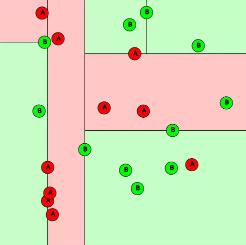

# Interactive Decision Tree Visualizer

Interactive Decision Tree Visualizer is a dynamic, visual demo for understanding decision tree classification. It uses p5.js to create an interactive canvas where points representing data can be added, altered, and removed. Users can tweak tree depth, minimum splits, and point jitter to see how a decision tree classifier responds to different parameters and noise.

## Features

- **Dynamic Point Interaction**: Click to add, modify, or delete points on the canvas.
- **Real-Time Decision Tree Updates**: The decision tree updates instantly with every interaction.
- **Adjustable Parameters**: Use sliders to adjust the depth of the tree, the minimum number of splits, and the jitter of the points.
- **Accuracy Tracking**: Real-time display of the accuracy of the decision tree given the current points and parameters.
- **Visual Splitting**: Visual representation of the decision tree's splitting boundaries.

## Usage

- **Add a Point**: Click on the canvas to add a new point. By default, points belong to class "A".
- **Toggle Point Class**: Click on an existing point to toggle its class between "A" (red) and "B" (green).
- **Remove a Point**: Right-click on an existing point to remove it from the canvas.
- **Adjust Depth**: Use the "Tree Depth" slider to set the maximum depth of the decision tree.
- **Set Minimum Splits**: Use the "Minimum Splits" slider to determine the minimum number of splits for the decision tree.
- **Add Jitter**: Use the "Jitter" slider to add random motion to the points, which can simulate real-world data variability.

# [try it out !!]()